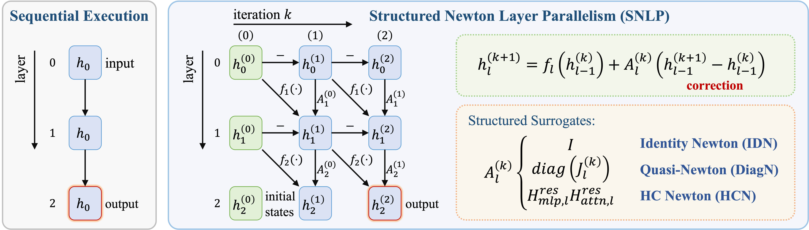

# SNLP: Structured Newton Layer Parallelism

Code for the paper *Layer-Parallel Inference via Structured Newton Corrections*. Code for the FHE extension is available on the [`snlp-fhe`](https://github.com/phymhan/nanochat-snlp/tree/snlp-fhe) branch.

[](https://arxiv.org/abs/2605.17842)



## Overview

Autoregressive language models execute Transformer layers sequentially, creating a latency bottleneck that is not removed by conventional tensor or pipeline parallelism. SNLP studies whether this layerwise dependency can be relaxed by treating the hidden-state trace across layers as the solution of a nonlinear residual equation and solving it with parallel Newton-style updates.

Exact Newton corrections require expensive Jacobian-vector products, while naive fixed-point iterations are unstable on trained Transformers. **Structured Newton Layer Parallelism (SNLP)** replaces exact layer Jacobians with cheap architecture-induced surrogate dynamics:

- **Identity Newton (IDN)**: For residual Transformers, the correction reduces to additive prefix-style propagation over depth.
- **HC Newton (HCN)**: For mHC-style architectures, uses the learned residual mixing matrix as the Newton surrogate.

SNLP-aware training includes pretraining regularization and direct SNLP-forward SFT. Experiments on Nanochat-scale Transformers show a practical speed-quality frontier: on 0.5B models, selected configurations reach up to **2.58x wall-clock speedup**, and a less aggressive configuration reaches **1.40x speedup** without increasing PPL. The useful tradeoff comes from the biased finite-iteration computation induced by IDN/HCN rather than exact recovery of the sequential trace. SNLP-forward SFT can preserve downstream task accuracy, and SNLP can also serve as a drafter for self-speculative decoding while a sequential verifier preserves output correctness.

## Project Structure

```
nanochat-snlp/
├── nanochat/                    # Core model library (GPT, tokenizer, training infra)
│   ├── gpt.py                   # GPT model with mHC, IDN/HCN reg support
│   └── jacobi_forward.py        # Jacobi iteration primitives, preheat calibration
├── scripts/                     # Training scripts
│   ├── base_train.py            # Main training entry point
│   └── base_eval.py             # Core evaluation
├── snlp/                        # SNLP inference and evaluation
│   ├── inference_idn.py         # IDN forward functions (batched, fused, chunkwise)
│   ├── inference_hcn.py         # HCN forward functions for mHC models
│   ├── inference_idn_ots.py     # IDN for off-the-shelf HF models (Qwen, TinyLlama, Gemma)
│   ├── eval_snlp.py             # Evaluation entry point (PPL, timing, top-1, cos_sim)
│   ├── eval_snlp_ots.py         # Evaluation entry for off-the-shelf models
│   └── demo_snlp_deer_qwen.py   # Standalone demo: exact/diagonal Newton on Qwen
└── runs_snlp/                   # Shell scripts to reproduce paper results
    ├── train_*.sh               # Training scripts for each model variant
    └── eval_idn_*.sh            # Evaluation scripts for selected configs
```

## SNLP Inference Methods

| Function | File | Description | Paper notation |
|----------|------|-------------|----------------|
| `forward_idn_batched` | `inference_idn.py` | IDN per-layer batched + prefix-sum correction | IDN NxF1 |
| `forward_idn_fused` | `inference_idn.py` | Fully fused mega-block (no inter-layer correction) | IDN 1xFN |
| `forward_idn_chunkwise` | `inference_idn.py` | Chunkwise fused + inter-chunk IDN correction | IDN CxFM |
| `forward_hcn_batched` | `inference_hcn.py` | HCN per-layer batched + H^res Newton correction | HCN NxF1 |
| `forward_hcn_chunkwise` | `inference_hcn.py` | Chunkwise fused + inter-chunk HCN correction | HCN CxFM |

**Config notation**: `CxFM-init` = C parallel chunks, each fusing M layers, with initialization `h0` (prefix state) or `batch_fwd` (one-shot forward). K = number of Newton iterations.

## Training Configurations

| Model | PPL | Key flags |
|-------|----:|-----------|
| Nanochat-3B baseline | 10.10 | `--depth=32 --fp8` |
| Nanochat-3B IDN | 10.07 | `+ --identity-newton-reg=0.5 --n-par-configs=8` |
| Nanochat-0.5B baseline | 15.21 | `--depth=32 --aspect-ratio=20` |
| Nanochat-0.5B IDN | 15.36 | `+ --identity-newton-reg=0.0625 --idn-stride=3` |
| Nanochat-0.5B w/o x0ve baseline | 17.65 | `+ --no-x0-resid --no-ve` |
| Nanochat-0.5B w/o x0ve IDN | 17.57 | `+ --no-x0-resid --no-ve --identity-newton-reg=0.5 --idn-stride=6` |
| Nanochat-0.5B-mHC baseline | 15.16 | `+ --use-mhc --mhc-num-streams=4` |
| Nanochat-0.5B-mHC HCN | 15.52 | `+ --use-mhc --mhc-num-streams=4 --mhc-newton-reg=0.5 --idn-detach-target` |

See `runs_snlp/README.md` for the exact reproduction scripts and selected SNLP evaluation configurations.

## Setup

```bash
# Install dependencies
uv sync

# Download training data (~15GB)
export NANOCHAT_BASE_DIR=$(pwd)/cache
uv run python -m nanochat.dataset -n 170

# Train tokenizer (~1 min)
uv run python -m scripts.tok_train
```

## Training

```bash
# Example: Train Nanochat-0.5B with IDN regularization (4 GPUs)
bash runs_snlp/train_d32s_idn.sh

# Or run directly:
NANOCHAT_BASE_DIR=cache uv run torchrun --standalone --nproc_per_node=4 \
    -m scripts.base_train -- \
    --depth=32 --aspect-ratio=20 --device-batch-size=8 \
    --num-iterations=4800 \
    --identity-newton-reg=0.0625 --idn-stride=3 --jacobi-reg-warmup=0.2 \
    --n-par-configs=8,16,24 \
    --model-tag=my_d32s_idn
```

See `runs_snlp/train_*.sh` for all model training scripts.

## Inference Evaluation

```bash
# Evaluate a specific SNLP config (single-config evaluator)
CUDA_VISIBLE_DEVICES=0 NANOCHAT_BASE_DIR=cache uv run python -m snlp.eval_snlp \
    --model-tag my_d32s_idn \
    --n-par 24 --method IDN_batched --K 4 --init h0

# Evaluate mHC model with HCN correction
CUDA_VISIBLE_DEVICES=0 NANOCHAT_BASE_DIR=cache uv run python -m snlp.eval_snlp \
    --model-tag my_d32s_mhc_hcn \
    --n-par 16 --method mHC-Newton --K 4 --init h0 --cache-hc

# Reproduce paper configs for a model variant
bash runs_snlp/eval_idn_d32s_idn.sh
```

### Off-the-Shelf Models

Evaluate SNLP on pretrained HuggingFace models (Qwen 2.5, TinyLlama, Gemma 3):

```bash
HF_HOME=/path/to/hf_cache CUDA_VISIBLE_DEVICES=0 uv run python -m snlp.eval_snlp_ots \
    --model Qwen/Qwen2.5-0.5B-Instruct --n-par 4 8
```

### Demo: Exact Newton Sanity Check

`demo_snlp_deer_qwen.py` is a standalone demo that implements all Newton variants on Qwen 2.5 0.5B. With exact (full Jacobian) Newton and enough iterations, the output converges to sequential for any off-the-shelf model — even with all 24 layers parallel:

```bash
# Exact Newton — all 24 layers parallel, converges to sequential output
HF_HOME=/path/to/hf_cache uv run python -m snlp.demo_snlp_deer_qwen \
    --jacobian full --jvp jvp --layer-start 0 --parallel-iters 16

# Diagonal Newton (VJP Hutchinson + associative scan) — 8 parallel layers
HF_HOME=/path/to/hf_cache uv run python -m snlp.demo_snlp_deer_qwen \
    --jacobian diag --jvp vjp --scan --layer-start 16 --parallel-iters 8
```

## Citation

```bibtex
@article{han2026snlp,
  title={SNLP: Layer-Parallel Inference via Structured Newton Corrections},
  author={Han, Ligong and Xu, Kai and Wang, Hao and Srivastava, Akash},
  journal={arXiv preprint arXiv:2605.17842},
  year={2026}
}
```


## Acknowledgement

This codebase builds on several excellent open-source projects:

- [Nanochat](https://github.com/karpathy/nanochat) by Andrej Karpathy — this codebase is largely based on Nanochat, which provides the model architecture, training infrastructure, data pipeline, and tokenizer
- [ELK](https://github.com/lindermanlab/elk) by Gonzalez et al. — quasi-Newton methods for parallelizing nonlinear recurrences
- [mHC](https://github.com/tokenbender/mHC-manifold-constrained-hyper-connections) by Xie et al. — manifold-constrained HyperConnections
- [SJD](https://github.com/tyshiwo1/Accelerating-T2I-AR-with-SJD/) by Teng et al. — Jacobi decoding for accelerating autoregressive models

We thank the authors for generously open-sourcing their work.
